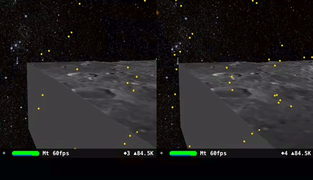
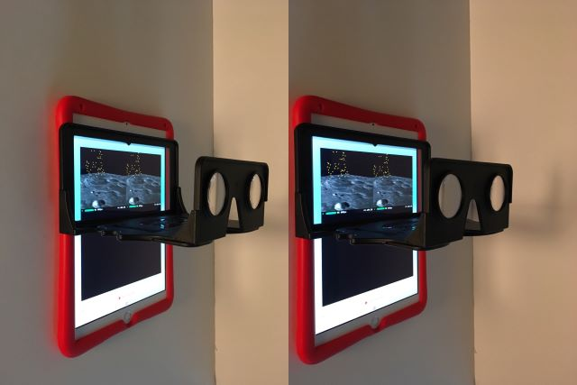

ARKit stereoscope to visualize OBJ files generated from https://trek.nasa.gov/moon.

The animated GIF above is from an 2018 Apple 9.7" iPad. The clip shows the iPad moving over a 3D model of Goclenius crater. The yellow dots are ARKit computer vision tracking features points (in this case, the iPad is moving along a bookshelf on the left side).

The swift code uses ARKit to track the iPad's movement with 6 degrees-of-freedom which allows Scenekit to display the proper stereoscopic view of 3D models.

# Hardware

1. Apple 9.7" iPad (tested on 2018 model, A9 CPU or higher for ARKit, should work on 2017 model)
2. The OWL Stereoscopic Viewer(£15.00) from The London Stereoscopic Company Ltd https://www.londonstereo.com/

# Software

1. Swift Playgrounds (2.2) from iOS App Store

It is advisable to get a protective silicon case for the iPad to minimize the stereoscope sliding on the screen. The stereoscopic viewer is held in place by the user to allow switching between viewing and programming Swift. "Portrait Orientation Lock" is turned on as this should be the most comfortable position to hold the iPad with the viewer.
